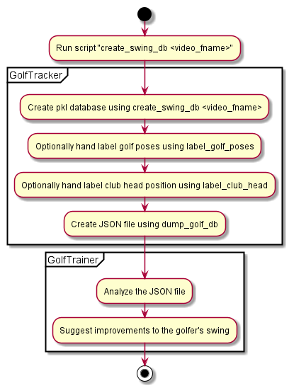

# Table of Contents
1. [Introduction](#INTRODUCTION) Purpose of the package.
2. [Installation](docs/source/installation.md) If you wish to use the package.
3. [Development](docs/source/development.md) If you wish to change the source code and enhance the package.

## Introduction
-------------------
The package provides various scripts to process a golf swing video and export the information to another package "GolfCoach" for analysis. The output feedback can then be used to improve the swing.

The package uses Google media pipe for detecting the golfer. It then detects the club head in the video and the golf poses to detect the start and finish of the golf swing. This information in written out to a json file that can be analyzed by a separate packge "GolfCoach" for analysis. 

This is shown below 


Some sample vides for down the line, right hand golfer is available on [GoogleDrive](https://drive.google.com/drive/folders/1TDUnGjP1wh1gZeN1EZdJOO4AeYuMLnkO?usp=sharing)


The general sequence of steps for a video say "0001.mov"

### Create Swing Database
This step runs google media pipe and stores all the landmarks. It will also try to detect the golf poses and club head position. Current version usually fails on this and requires hand labellling.
```
create_swing_db 00001.mov
```

### Hand Label GolfPoses
Run the script below to label the golf poses. The golf pose consist of 
* Start Pose: 
* Top Pose: Indicates that the backswing is now complete.
* Finish Pose: Indicates that the swing is complete.

```
label_golf_poses 00001.pkl
```

### Hand Label Club Head Position
Label the club head in some of the frames. The script will then use a linear approx to fill the position in the remaining frames.

```
label_club_head 00001.pkl
```

### Export To Json
Export the information to a json file for analysis by the GolfCoach package.

```
dump_swing_db 00001.pkl
```

## Status
WIP: Detailed src documentation of this package is on [ReadTheDocs](https://golftracker.readthedocs.io/en/latest/)


## Status
The current steps are listed here [GolfSwingCapture](docs/source/golfswing_capture.md)
Initial thoughts on swing analysis are here [GolfSwingAnalysis](docs/source/golfswing_analysis.md)

