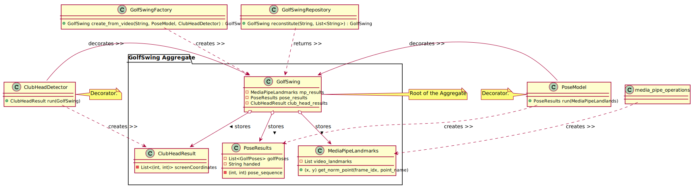

# Development
---------------
The source repository is in [GitHub](https://github.com/sanjeevs/golftracker). 
The overall software design is shown below 

The development flow is similar to other python projects.
* Clone the project.

```
git clone https://github.com/sanjeevs/golftracker.git
```

* Create a virtual env and install all the dependencies

```
base> python -m venv venv
base> venv/Scripts/activate
venv>
venv> cd golftracker
(venv)golftracker> pip install -r requirements.txt
```

* Run unit tests for sanity. Hopefully they all pass.

```
(venv)golftracker> pytest
```

* Install the package locally for development.

```
 pip install -e .
```

## Distribution
------------------------
For releasing the package to [pypi](https://pypi.org/project/golftracker/)

* Bump the version in setup.py

```
setup(
    name="golftracker",
    version="2.0",
    ...
)
```

* Build the distribution
Build the wheel package format in *dist/* directory with suffix *.whl*

```commandline
pip install wheel
python setup.py bdist_wheel
```

* Upload the distribution
Upload to pypi. This commant will prompt for username and password.

```commandline
pip install twine
twine upload dist/*
```

